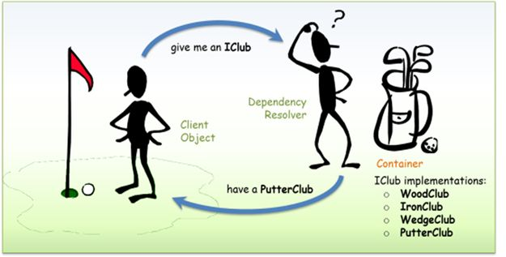

So you've hacked together a school project of a native Android app. Your idea is great and you want to scale it to 1,000 users and beyond. Let's say you are the project's BDFL (benevolent dictator for life), what should you do?

Below is my suggestions in a roadmap format for your consideration. If you are building a new mid - large sized Android app, this is for you too, but you have the glorious pleasure of doing all of the below from day zero.

## Day 1 - 50

## Are you practising Clean Code?

This doesn't have to be hours spent refactoring old code, just practise the Scout's Principle - leave a campsite cleaner than you found it: every time you write something new, clean the related areas up a bit.

My three clean code mainstays are: [meaningful names, reduce rubbish comments, and extract until you drop](../clean-code/).

## RTFM (read the f…flaming manual)
Realise that you're not doing generic backend or web frontend. You need a good understanding of specialist Android domain knowledge. Read the official documentations. Here are three of my must haves:

- Activity and fragment [lifecycles](https://developer.android.com/guide/components/activities/activity-lifecycle)
- Popular view widgets and what adapters are, eg. [RecyclerView](https://developer.android.com/guide/topics/ui/layout/recyclerview)
- [Background tasks and services](https://developer.android.com/guide/background)

## Don’t reinvent the wheel

Are you taking on responsibilities too big for you? Please don’t. You are standing on shoulders of giants, and all the libraries are here for you.

For example, are you reinventing security from scratch? If you are storing login credentials with a DIY database table, please switch to a mature platform like [Firebase Auth](https://firebase.google.com/products/auth/) or [Azure AD](https://azure.microsoft.com/en-us/services/active-directory/).

## Critique your work with SOLID

We'll just use S, O, L out of the [SOLID principles](https://en.wikipedia.org/wiki/SOLID) for now. We will talk about I and D later.

Look at your classes, especially the POJOs (plain old Java objects) you’ve created, do they conform to these principles?

**[S] Single Responsibility:** this means to make sure your classes only have one reason to change.

**[O] Open for extension, closed for modification:** are your classes future proof? to alter them, you should only have to extend them instead of changing their properties.

**[L] Liskov Substitution:** are you using inheritance correctly? Can users of the base class do everything without knowing which daughter class it is?

I won’t be reinventing the wheel here and will just link you to [these good code examples](https://android.jlelse.eu/android-development-the-solid-principles-3b5779b105d2).

## Day 50 - 100

We continue with the SOLIDisation, time to introduce some more ambitious structural changes:

## Bring in the middle layer

You are doing more and more with the app. It is crying out for a "middle layer" that handles its business logic (especially the ones duplicated across activities and fragments). Mercilessly rip these logic out into reader/ writer/ handler/ service classes.

**[I] Interface Segregation:** no client should be forced to depend on methods it does not use.

For example, after creating a new handler class, have a look at whether any Activity or Fragment is not using all the methods provided by this new handler. Let’s consider an imaginary `UserProfileHandler` that does CRUD on user profiles:

```
class UserProfileHandler {
    function void Create(UserProfile profile) {...}
    function UserProfile Read(User user, int profileId) {...}
    function void Update(UserProfile profile) {...}
    function void Delete(UserProfile profile) {...}
}
```

If you have a `UserSignUpFragment` that only uses the `Create()`, a `UserProfileFragment` that uses `Update()` and `Read()`, and an `AdminActivity` that uses them all, it's clear that this should be split up into at least three interfaces.

## Dependency injection with Dagger

**[D] Dependency Inversion:** this principle encourages you to decouple your software components, and to use abstractions/ contracts to link them up (interfaces).

You may have noticed that you are new-ing up a lot of these new middle layer classes, using them directly. This is undesirable (... and it makes testing and mocking difficult).

Start using interfaces, which are contracts for what the middle layer should be. The activities and fragments trust that the interface methods will return what is promised, and the concrete middle layer implementations trust the activities and fragments will provide the parameters required.

[Dagger](https://dagger.dev/) is a tool that will help you achieve that, it is a dependency injection/ resolver tool. That means it will help find the concrete implementation of an interface for a client.



Before:
```
class UserSignUpFragment : Fragment {
    private UserProfileCreator profileCreator;
    public UserSignUpFragment () {
        profileCreator = new UserProfileCreator();
    }
}
```

After:
```
class UserSignUpFragment : Fragment {
    private IUserProfileCreator profileCreator;
    // Dagger will inject the correct UserProfileCreator into the constructor param
    public UserSignUpFragment (IUserProfileCreator profileCreator) { 
        this.profileCreator = profileCreator;
    }
}
```

The beauty of this decoupling, is that your code now works like reusable components. It allows for different concrete implementations of the same interface at the same time, or in the future. For example, your team could decide to switch from Firebase to Azure for user authentication, and the classes using the interface `IUserProfileCreator` don’t have to change at all. You just write a new `AzureUserProfileCreator`, and swap out the old `FirebaseUserProfileCreator` in Dagger configurations.

## Bring order to the madness: MVP / MVVM

Your team needs to buy into an organisation pattern: I'm personally more comfortable with the MVP (Model View Presenter) paradigm, which reminds me of MVC. You can find many beautifully written open source MVP apps on Github, such as [Firefox Lockwise](https://github.com/mozilla-lockwise/lockwise-android).

However, there are a growing number of blogs about how MVVM is the new official Google approach. Here is a [really cool code comparison of organisation patterns in Android using a tic-tac-toe example](https://academy.realm.io/posts/eric-maxwell-mvc-mvp-and-mvvm-on-android/).

Remember these can be gradually introduced. You can build a new activity in MVP/ MVVM style, and that would coexist fine with your old code (be patient with it, Rome isn’t built in a day). 

Once you are done, you won’t believe how fat your classes used to be, and you will no longer have trouble finding where things are.

## Unit testing:

This goes hand in hand with all the refactoring done above. All the heavy lifting logic has been split out of your activities, they are now simple Java classes that you can test with traditional frameworks like JUnit thoroughly.

When testing classes that consumes interfaces, you will need to mock the responses of the interfaces. You will want to use a mocking library like [Mockito](https://site.mockito.org/).

If you have followed MVP / MVVM it will be even more obvious what you can test, see [some code examples here](https://medium.com/@MiBLT/testing-android-mvp-aa0de6e165e4).

## Day 100+

## Cover all the holes

90+% coverage is something to aspire towards, some engineering teams will even enforce it. Just don’t fake it (eg. only have one test that assert the return is not null). Always have at least the positive case, the negative cases, the null/ empty case, and edge cases.

Now you can be even more fearless when refactoring, because you know your test suite will tell you if something breaks.

## Towards TDD:

Now do a complete shift in your mindset, and attempt to write as many tests as possible when you pick up a bug/ feature, before changing any of the app code.

You can now do test-driven development (TDD), because you are now experienced in writing tests and there are plenty of examples of what a test should look like.

## End-to-end coverage

Click-monkeying is fun and all, but it could get repetitive, especially when the app grows and you need regression testing (test that previously working things are not now broken).

Time to have a look at the UI testing framework recommended by Google named [Espresso](https://developer.android.com/training/testing/espresso/).

## 👏

And there it is: your project has been turned around and ready for the big leagues. Most importantly, it is now more reliable and maintainable than ever, ready for business-as-usual, more team members and the sweet sweet investor moneys.

Thanks for reading the whole thing!