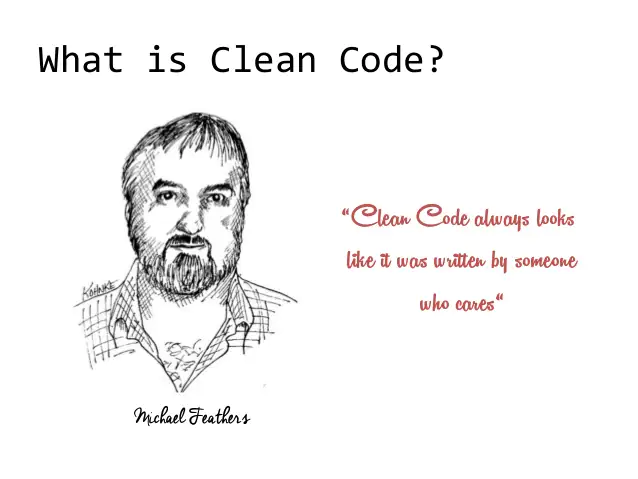

Writing good code sounds difficult. What is objectively good? Do you have to study a lot of theories to get there? Where do you go learn this stuff? Go no further to get the three minute version of it here:

## Clean Code

Out of the software engineering industry came a shining beacon that is [Uncle Bob's school of thought](http://cleancoder.com/products), which has dominated the industry just like the agile manifesto. Detailed in his 2008 book Clean Code is his widely adopted idea for what is good code:

> Code is read more than it is written or changed. So code that is easy to read makes the lives of everyone easier. If you write clean code, it should read like prose even to the worst programmer.

Here are the three things from his book that anyone, even the freshest programmer, can do to vastly improve their code from day one, absolutely no extra knowledge required:

## 1. Use meaningful names

That is meaningful names for everything from variables, methods, to classes. What does that mean? It means instead of naming things like:

```
function fx (string text, int number){
    ds.Save(text)
    logFunc(number)
}
```

which provided almost no context whatsoever, type what you really mean in the real world:

```
function saveStatus (string statusText, int actionCode){
     dataStore.Save(statusText)
     logActionType(actionCode)
}
```

Agree as a team what are some of the most common names and concepts you will be using. It should use simple language unless you are working with industry terminologies, or following a well known design pattern.

Better yet, agree with your client/ business, and do some [domain driven design](https://en.wikipedia.org/wiki/Domain-driven_design). Using the same lingo as the business means even if your team and wiki dies in fire and blood, new developers will still be able to learn it.

## 2. Avoid comments like the plague

If you have done the above, your code should already be a lot more understandable to any fresh pairs of eyes. That makes a good majority of your comments redundant.

Comments migrate: if you have a lot of them, you are most likely just repeating yourself, and you will end up copying, pasting, and forgetting to change them, eg:

```
// Constant string for the name of the url, it cannot be changed
const string url = "URL"

// Constant string for the name of the url, it cannot be changed
const string path = "PATH"
```

Comments rot, because if they are not maintained, the program still runs:

```
// Next we calculate a percentage value of x times y (no longer true)
// x means number of passengers, y means number of vehicles
int i = i / 2 * v * 100
```

Comments should not replace laziness, or unfinished work, eg:

```
// TODO: please give this some tender loving care, it's broken (but is somehow pushed and merged anyway)
// T1 of tp is max, T2 of tp is min (omg please don't use tuples/ sets, just make it a class, no one knows what you mean)
Set tp (int a, int b) = (18, 7)
```

Some comments which offer critical clarifications cannot be avoided. Always remember that comments are only effective and attention drawing when used sparingly.

Uncle Bob said:

> Every comment represents a failure to make the code self explanatory.

Going full purist [self-documenting code](https://en.wikipedia.org/wiki/Self-documenting_code) may not be a good idea, if what you are doing is truly complicated and you are beginning to end up with super long names for things. But it is what you should aim to do 90% of the time.

## 3. Extract until you drop

Extracting functions/ methods is a very good way to refactor your code. This provides two main benefits: it makes your code easy to skim; and it shows you what belongs and what doesn't belong in a class.

Just like a news article, your code/ files/ classes should read from macroscopic to microscopic. In journalism, this is known as the [inverted pyramid](https://en.wikipedia.org/wiki/Inverted_pyramid_(journalism)). Your code should take a reader through the big overview/ important information first, and everything should be extracted out, eg:

```
public void GenerateStatusView (int text, string color){
    ValidateText(text);
    ValidateColorString(color);
    return StatusViewModel(ProcessText(text), ConvertColor(color))
}
private void ValidateText(...){...}
private void ValidateColorString(...){...}
private string ProcessText(...){...}
private Color ConvertColor(...){...}
```

Instead of having all the small bits of logic jumbled up together in one very very fat function/ method, the reader can pick and choose which subsection they want to read and which to skip. Maybe there is a bug with the color conversion, they can jump to that because of your extractions and good signposting, instead of trying to read 20 lines of other minute details about how the text is validated.

If you extract further, you may discover bits of logic that are duplicated, bits that don't belong in the class, and could be taken out into another/ a new class. For example, maybe the logic of `ValidateColor()` is used across many different classes, you might want to start a new static class for that.

Uncle Bob encourages extracting until you can't anymore: that every function/ method only does one thing. [What is one thing? Here's his explanation.](https://sites.google.com/site/unclebobconsultingllc/one-thing-extract-till-you-drop) I personally think his version could be a bit extreme sometimes, but I definitely would not have a function/ method that goes longer than half the height of your IDE on a small laptop screen.



Congratulations if you are already doing, or will start doing the steps above! You have begun a Clean Coder journey that will allow you to frown upon other beginners' code and argue about best practices! Read more about Uncle Bob's school of thought, and have the conversation with your team, it shows that you care.